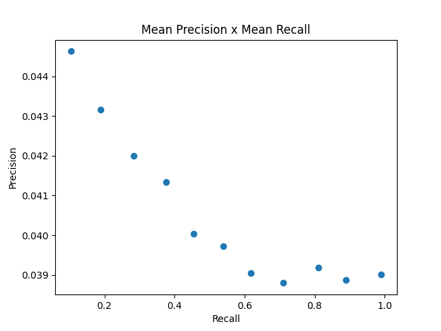
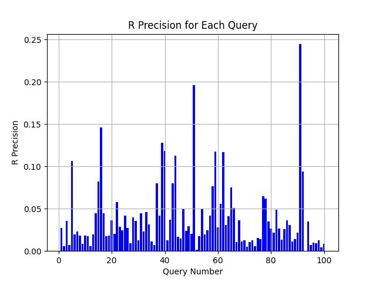

# Avaliação dos Resultados

Total de queries: 99

Utilizando Porter Stemmer? Não

## 11-point precision recall curve

## F1 Score

F1 Score médio das queries: 0.0724696466960625

## Precision@5

Precision@5 médio das questies: 0.06666666666666667

## Precision@10

Precision@10 médio das questies: 0.06262626262626261

## Histograma R-Precision

## Mean Average Precision

Mean Average Precision das queries: 0.04829882977107182

## Mean Reciprocal Rank

Mean Reciprocal Rank das queries: 0.7418991502324837

## Discounted Cumulative Gain

Discounted Cumulative Gain médio das queries: 0.8541325185765266

## Normalized Discounted Cumulative Gain

Normalized Discounted Cumulative Gain médio das queries: 0.027783998734322142

