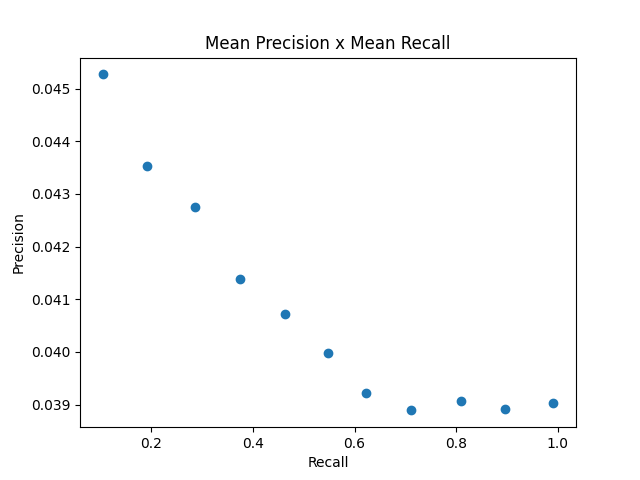

# Avaliação dos Resultados

Total de queries: 99

Utilizando Porter Stemmer? Sim

## 11-point precision recall curve

## F1 Score

F1 Score médio das queries: 0.0724696466960625

## Precision@5

Precision@5 médio das questies: 0.08080808080808081

## Precision@10

Precision@10 médio das questies: 0.0707070707070707

## Histograma R-Precision

## Mean Average Precision

Mean Average Precision das queries: 0.04967016979703793

## Mean Reciprocal Rank

Mean Reciprocal Rank das queries: 0.7312249478916145

## Discounted Cumulative Gain

Discounted Cumulative Gain médio das queries: 0.9886762276759508

## Normalized Discounted Cumulative Gain

Normalized Discounted Cumulative Gain médio das queries: 0.032881880410921605

